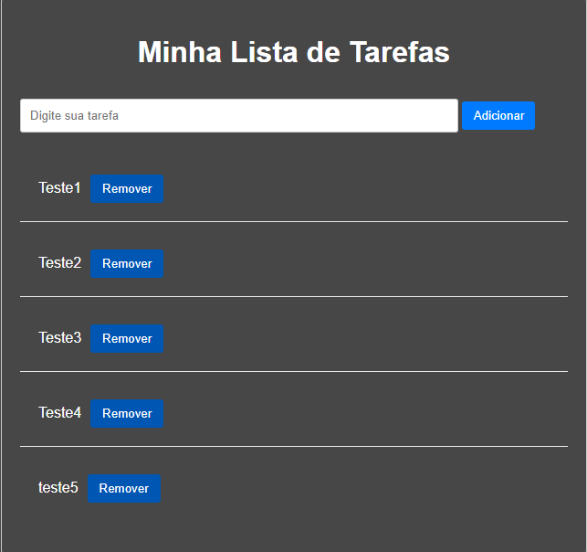

# 📝 To-Do List

Uma aplicação simples de lista de tarefas desenvolvida com HTML, CSS e JavaScript puro.

## 🚀 Funcionalidades

- Adicionar tarefas
- Marcar tarefas como concluídas
- Remover tarefas
- Armazenamento local com `localStorage` (as tarefas permanecem salvas mesmo após atualizar a página)

## 🛠️ Tecnologias Utilizadas

- HTML5
- CSS3
- JavaScript (Vanilla JS)
- `localStorage`

## 📸 Demonstração

 <!-- Substitua com um print do projeto ou remova esta linha se não tiver -->

## 📁 Como usar

1. Clone este repositório:

```bash
git clone https://github.com/RiaanVictor07/To-do-List.git

